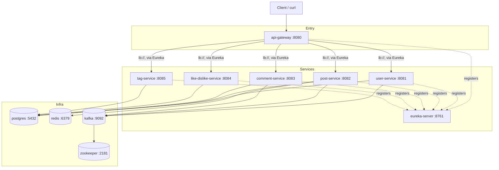

# Kubernetes Dependency Graph

Dependency graph for the `blog` namespace on the local kind cluster (`k8s/`).

- Solid arrows = actual runtime calls/connections.
- Dashed arrows = Eureka registration (every service announces itself to `eureka-server`; `api-gateway` resolves `lb://<service>` through that registry at request time).
- `api-gateway` is the only component reachable from outside the cluster — everything else is internal-only, matching `docker-compose.yml` only publishing `8080` and `8761` to the host.
- `kafka` depends on `zookeeper`, not the reverse.
